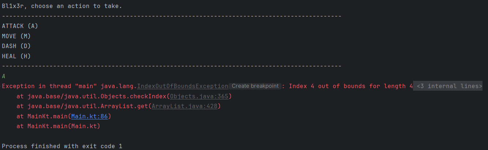
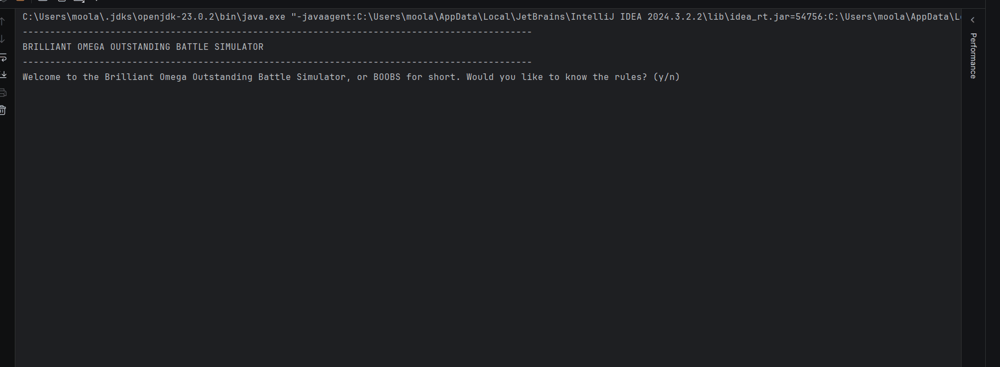

# Results of Testing

The test results show the actual outcome of the testing, following the [Test Plan](test-plan.md)

---

## multi attacking weapon

Tested to see if weapons that attack multiple times actually work

### Test Data Used

I tested a weapon with multiple attacks on the opponent

### Test Result

There is a problem with the way I stored the multi attack property. I only added the property to weapons that were meant to have it, so when i checked for it, if it was a weapon that didnt have the index, it broke. So i added the index to all of them, but if the value was 0, then it would attack once, but if it was 1, then it would go with the multiple attack procedure, and this worked.

---

## Turn loop test

ends the program after a player's health reaches 0

### Test Data Used

I attacked the opponent until their health dropped below zero

### Test Result

The condition I used only check if one player's health was above zero, so if only one player's health went below 0 the game would continue. By changing the || to an &&, it makes it so that when either player dies, the game ends.

---

## health potion system

allows the player to gain back health

### test data used

---

## dashing

dashing moves the player two times their move speed in one turn, but gives the opponent two turns in a row.

### test data used

I put continue after the dash option so it skips the player-opponent change

### test result

it did not infact skip the players next turn, but because it didn't change who was playing and who was opposing, it gave the current player infinite turns until they stop dashing.

