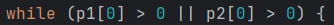

# Results of Testing

The test results show the actual outcome of the testing, following the [Test Plan](test-plan.md)

---

## getChar Function

This function gets a character from a string of user input

### test data used

I added a block of code where it used the getChar function and printed out the return value

### test result

works as intended

---

## chooseRace function

It is what lets the player decide their health and move speed (rate at which they can change the distance between two players)

### test data used

I selected the races

### Test result

I started by putting a bunch of googily moogily nonsense, and it denied everything invalid. I then put in a valid option, D for Dwarf, and it returned the correct value

I then put in a bit more rubbish, and then another valid option, E for Elf

(its valid because getChar only looks for the first character in a string)

finally, I tested if H for Human would work and it did

---

## multi attacking weapon

Tested to see if weapons that attack multiple times actually work

### Test Data Used

I tested a weapon with multiple attacks on the opponent

### Test Result

There is a problem with the way I stored the multi attack property. I only added the property to weapons that were meant to have it, so when I checked for it, if it was a weapon that didn't have the index, it broke. So I added the index to all of them. If the value was 0, then it would attack once, but if it was 1, then it would go with the multiple attack procedure, and this worked.

After storing it properly, I tested and the first time I got 4 attacks off, the upper limit.

The next time I got 1 attack, the lower limit.

Finally, I got 2 attacks, which is within the limits.

---

## Turn loop/winning test

ends the program after a player's health reaches 0

### Test Data Used

I attacked the opponent until their health dropped below zero

### Test Result

The condition I used only check if one player's health was above zero, so if only one player's health went below 0 the game would continue. By changing the || to an &&, it makes it so that when either player dies, the game ends.

(I also changed a bit of how the code was written in the time between)

---

## health potion system

allows the player to gain back health, specifically a random number between 40 and 50

### test data used

I healed in game 

### Test result

the first time I healed the max 50

The next time I healed it gave me 47 health

I then tested until it healed me the minimum 40 health

---

## attacking

lets the players fight each other

### test data used

I attacked an opponent in a test match

### test result

It took away the weapons damage value from the opponent's health. works as intended

The following battle "a" was a Dwarf (125 Health) with a longsword (50 damage) and "b" was a Human (100 health) with a longbow (40 damage)

---

## movement

Lets the players move in and out of the other's weapon's range

### test data used

I moved left and right in a test match

### test result

It moved the correct value for each race, and it didn't let player 1 past player 2, or player 2 past player 1

The following battle "a" was a dwarf (2 movespeed) and "b" was a Human (3 movespeed)

dwarf movement is correct

player 2 can't move past player 1

human movement is correct

player 1 can't move past player 2

The following battle "a" was an elf (4 movespeed) and b is a human, and it shows the elf movement is correct

everything works as intended

---

## turn system and end loop works

This ensures the game is actually a game and not one player wailing on the other

### test data used

I played a match with myself 

### test result

the gif below shows me play a short match with myself. TestA was a Dwarf with a Woodstaff. TestB was a Human with a Quickbow. Everything works as intended

