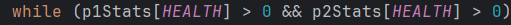

# Results of Testing

The test results show the actual outcome of the testing, following the [Test Plan](test-plan.md)

---

## multi attacking weapon

Tested to see if weapons that attack multiple times actually work

### Test Data Used

I tested a weapon with multiple attacks on the opponent

### Test Result

There is a problem with the way I stored the multi attack property. I only added the property to weapons that were meant to have it, so when i checked for it, if it was a weapon that didnt have the index, it broke. So i added the index to all of them. If the value was 0, then it would attack once, but if it was 1, then it would go with the multiple attack procedure, and this worked.

After storing it properly, I tested and the first time I got 4 attacks off, the upper limit.

The next time I got 1 attack, the lower limit.

Finally I got 2 attacks, which is within the limits.

---

## Turn loop/winning test

ends the program after a player's health reaches 0

### Test Data Used

I attacked the opponent until their health dropped below zero

### Test Result

The condition I used only check if one player's health was above zero, so if only one player's health went below 0 the game would continue. By changing the || to an &&, it makes it so that when either player dies, the game ends.

(I also changed a bit of how the code was written in the time between)

---

## health potion system

allows the player to gain back health, specifically a random number between 40 and 50

### test data used

I healed in game 

### Test result

the first time I healed the max 50

The next time I healed it gave me 47 health

I then tested until it healed me the minimum 40 health

---

## chooseRace function

It is what lets the player decide their health and move speed (rate at which they can change the distance variable)